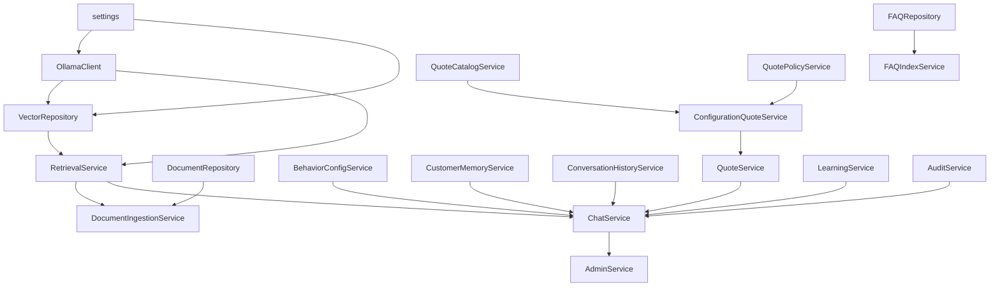
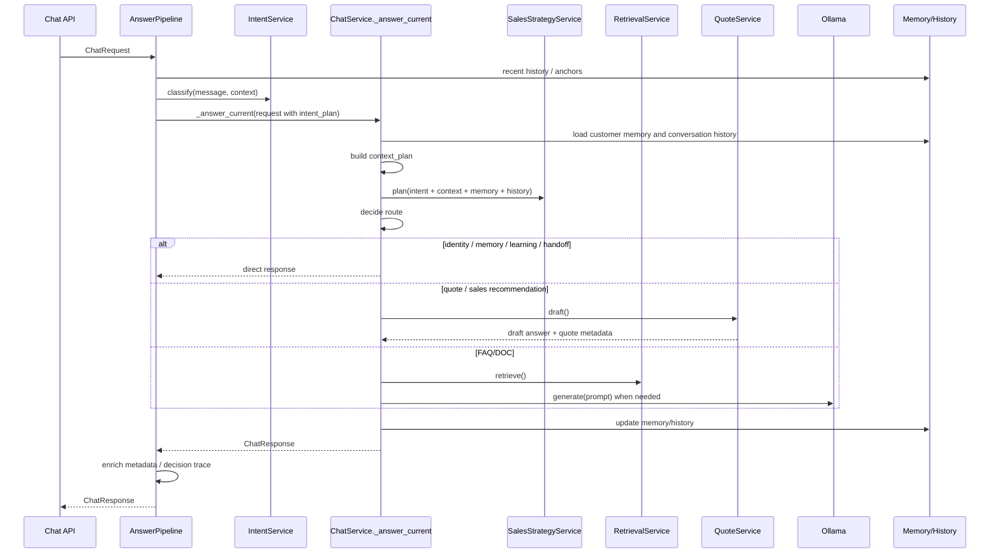

# Local AI Support 项目交接文档

本文档用于把 `tg7458258668-rgb/Local_AI_Support` 交接给后续 AI 或工程师。重点覆盖项目目标、功能边界、架构、核心链路、数据文件、接口、最近销售策略改造、运行测试方式和继续开发注意事项。

## 0. AI 快速接手摘要

截至 2026-05-27，当前分支是 `main`，发布基线是 `v2.3.1`。工作树里有一组尚未提交的销售策略改造，本文件 `AI_HANDOFF.md` 也是新增交接文档。

下一位 AI 最先看这些文件：

```text
AI_HANDOFF.md
README.md
support_app/main.py
support_app/dependencies.py
support_app/services/chat_service.py
support_app/services/answer_pipeline.py
support_app/services/intent_service.py
support_app/services/sales_strategy_service.py
support_app/services/retrieval_service.py
tests/test_context_planning.py
```

当前主入口和实际页面路由：

```text
FastAPI app: support_app.main:app
聊天页: /
管理后台: /admin
API 文档: /docs
聊天 API: POST /api/v1/chat, POST /api/v1/chat/ask, POST /ask
```

注意：`README.md` 的快速入口里仍写过 `/chat`，但当前 `support_app/web_pages.py` 实际挂载的是 `/` 作为聊天页。如果后续需要对外统一为 `/chat`，应新增兼容路由或同步修 README。

当前未提交改造聚焦在“真实销售式回答能力”：

```text
M  data/agent_behavior_rules.json
M  support_app/services/answer_pipeline.py
M  support_app/services/behavior_config_service.py
M  support_app/services/chat_service.py
M  support_app/services/retrieval_service.py
M  tests/test_context_planning.py
?? support_app/services/sales_strategy_service.py
?? AI_HANDOFF.md
```

接手时不要直接重置这些文件。它们是一组相关改造：

- `sales_strategy_service.py` 新增销售阶段规划，不直接生成最终回答。
- `chat_service.py` 把 `intent_plan + context_plan + sales_plan` 结合后再路由。
- `answer_pipeline.py` 合并销售决策 trace 和工具 trace。
- `retrieval_service.py` 的缓存 key 扩展到 embedding 模型和上下文。
- `agent_behavior_rules.json` 与 `behavior_config_service.py` 增加销售策略配置。
- `tests/test_context_planning.py` 增加销售推荐、追问继承、报价 readiness、售后直答、合同 handoff、上下文缓存绕过等回归测试。

推荐接手顺序：

1. 先跑 `.venv/bin/python -m pytest tests/test_context_planning.py`，确认最近销售策略测试仍过。
2. 再跑完整 `.venv/bin/python -m pytest`。
3. 若要继续改销售口径，优先改 `SalesStrategyService` 和 `data/agent_behavior_rules.json`，再补 `tests/test_context_planning.py`。
4. 若要整理发布，按 `docs/RELEASE_WORKFLOW.md` 更新版本、CHANGELOG、测试、提交和打 tag。

## 1. 项目定位

`Local AI Support` 是一个本地运行的 AI 客服与销售支持系统，主要服务 U-MOCO 产品资料、FAQ、售后政策、文档知识库、报价规则和多渠道客服接入。

当前主应用入口是：

```text
support_app.main:app
```

推荐启动方式：

```bash
cd /Users/ai_studio/ai-cs-mvp-refactor
source .venv/bin/activate
uvicorn support_app.main:app --reload --port 8000
```

主要访问入口：

```text
聊天页：http://localhost:8000/
管理后台：http://localhost:8000/admin
API 文档：http://localhost:8000/docs
```

项目当前 README 标记版本为 `v2.3.1`，FastAPI 应用版本也在 `support_app/main.py` 中写为 `2.3.1`。

## 2. 技术栈与运行依赖

核心技术：

- Python 3.11+
- FastAPI
- Pydantic
- Jinja2
- Qdrant 向量数据库
- Ollama 本地模型服务
- PyMuPDF / python-docx 文档处理
- 原生静态前端 JS/CSS

默认外部服务：

```text
Ollama: http://localhost:11434
Qdrant: http://127.0.0.1:6333
默认 embedding 模型: bge-m3
默认 chat 模型: qwen3:8b
```

主要依赖文件：

```text
requirements.txt
.env.example
support_app/settings.py
```

重要环境变量：

```text
AI_CS_BASE_DIR
AI_CS_DATA_DIR
QDRANT_URL
OLLAMA_URL
EMBED_MODEL
CHAT_MODEL
FAQ_COLLECTION
DOC_COLLECTION
TOP_K_FAQ
TOP_K_DOC
FAQ_SCORE_THRESHOLD
DOC_SCORE_THRESHOLD
FAQ_DOC_MARGIN
RETRIEVAL_CACHE_TTL_SECONDS
FAQ_DIRECT_ANSWER_THRESHOLD
MEMORY_ENABLED
```

## 3. 目录结构

```text
support_app/                  新版 FastAPI 应用，后续新功能优先放这里
  api/
    v1/
      chat.py                 /api/v1/chat 和 /api/v1/chat/ask
      admin.py                新版后台 API
      integrations.py         微信、飞书等 webhook
      health.py               健康检查
    legacy_admin.py           旧后台 API 兼容层
    system.py                 本地服务启动/停止/重启 API
  adapters/                   多渠道消息适配器
  repositories/               JSON、CSV、Qdrant 等数据访问层
  services/                   主要业务逻辑
  schemas.py                  Pydantic 请求/响应模型
  settings.py                 环境配置
  main.py                     FastAPI app 创建入口
  web_pages.py                页面路由

app/                          旧页面、静态资源和兼容逻辑
  static/
    admin.js
    chat-v2.js
    ...
  templates/
    admin.html
    chat.html

data/                         本地业务数据与知识库
scripts/                      文档解析、知识库构建、调试脚本
tests/                        单元测试与回归测试
tools/                        文档处理、启动器相关工具
runtime/                      运行日志、pid 等本地运行产物，不应提交
support_launcher.py           本地启动器
本地AI客服启动器.command       macOS 双击启动入口
```

旧 `app/` 目录仍保留页面和兼容代码。除非明确做前端页面改造，新后端功能应放在 `support_app/`。

## 4. 应用启动与路由装配

`support_app/main.py` 创建 FastAPI app，并挂载：

- `/api/v1/health`
- `/api/v1/chat`
- `/api/v1/integrations`
- `/api/v1/admin`
- `/api/admin` 旧后台兼容接口
- `/api/system` 本地系统控制接口
- `/`、`/admin` 等页面路由
- `/static` 静态资源

它还保留旧版 `/ask`：

```text
POST /ask
{"question": "..."}
```

内部会转换成 `ChatRequest(message=req.question, channel="api")`，然后调用 `get_chat_service().answer()`。

## 5. 依赖注入与服务生命周期

依赖集中在 `support_app/dependencies.py`。大量服务通过 `@lru_cache` 单例化。

核心依赖关系简化如下：



如果后续改配置、模型、知识库或报价服务，优先检查 `dependencies.py` 的注入关系。

## 6. 核心聊天请求/响应模型

定义文件：`support_app/schemas.py`

请求模型：

```python
class ChatRequest(BaseModel):
    message: str
    channel: Literal["api", "wechat", "feishu"] = "api"
    conversation_id: str | None = None
    user_id: str | None = None
    metadata: dict[str, Any] = {}
```

响应模型：

```python
class ChatResponse(BaseModel):
    answer: str
    route: Literal[
        "identity",
        "faq",
        "doc",
        "learned_correction",
        "memory_recall",
        "quote_draft",
        "handoff",
        "fallback",
        "error",
    ]
    need_human: bool
    hint: str
    matched_rule: str | None
    faq_top_score: float
    doc_top_score: float
    sources: list[SourceItem]
    retrieval_debug: list[dict]
    memory: dict | None
    timings: TimingInfo
    channel: ChannelName
    conversation_id: str | None
    user_id: str | None
    metadata: dict
```

注意：最近改造没有新增公开响应字段，新增调试信息全部放在 `metadata` 中，避免破坏 API 兼容。

## 7. 聊天主链路

入口：

```text
POST /api/v1/chat
POST /api/v1/chat/ask
POST /ask
```

核心文件：

```text
support_app/services/answer_pipeline.py
support_app/services/chat_service.py
support_app/services/intent_service.py
support_app/services/sales_strategy_service.py
support_app/services/retrieval_service.py
support_app/services/quote_service.py
support_app/services/configuration_quote_service.py
```

当前链路：



### 7.1 AnswerPipeline

文件：`support_app/services/answer_pipeline.py`

职责：

- 构建请求级上下文。
- 调用 `IntentService` 得到 `intent_plan`。
- 把 `intent_plan` 写入 `request.metadata`。
- 调用旧但仍主要承载逻辑的 `ChatService._answer_current()`。
- 回答后追加工具摘要、质量标记、`decision_trace`、`used_tools` 等 metadata。

当前它仍不是完整业务编排层，但已经承担每轮回答前的 intent 规划。

### 7.2 IntentService

文件：`support_app/services/intent_service.py`

职责：

- 用规则优先识别用户意图。
- 低置信度时可尝试本地模型辅助分类。
- 输出 `IntentResult`，最终转成 metadata 中的 `intent_plan`。

主要 intent：

```text
identity
memory_followup
quote_price
quote_recommendation
quote_configuration_sheet
knowledge_lookup
handoff
correction_learning
clarify
fallback
```

原则：

- “团播/直播间/机械臂/轨道”等单独出现只是场景或实体，不自动报价。
- “多少钱/价格/报价/预算/费用”才是价格意图。
- “推荐/选型/用哪款”才是推荐意图。
- “保修/质保/售后/参数/标配/配置是什么”优先知识查询。
- 合同、库存、最低价、保证、交付承诺类倾向人工确认。

### 7.3 ChatService

文件：`support_app/services/chat_service.py`

这是当前最核心的回答执行层。职责：

- 加载客户记忆。
- 加载最近会话历史。
- 构建 `context_plan`。
- 调用 `SalesStrategyService` 生成 `sales_plan`。
- 处理 identity、memory recall、纠错学习、人工接管。
- 决定走报价草案、销售推荐、FAQ、DOC、学习知识或兜底。
- 写入客户记忆和会话历史。
- 写审计日志。

重要内部函数：

```text
_answer_current()
_build_context_plan()
_context_plan_with_sales()
_apply_sales_metadata()
_should_use_sales_quote()
_render_quote_not_ready_answer()
_route()
_request_for_intent()
_intent_needs_quote()
_requires_handoff()
```

### 7.4 SalesStrategyService

文件：`support_app/services/sales_strategy_service.py`

这是最近新增的“销售对话策略层”。它不直接生成最终回答，只输出结构化决策：

```text
sales_stage
known_needs
missing_fields
soft_question
recommendation_goal
should_quote
should_direct_answer
route_reason
recommendation_basis
quote_readiness
decision_trace
```

`sales_stage` 取值：

```text
discovery      需求理解阶段
recommend      初步推荐阶段
quote_ready    关键配置基本齐备，可以生成报价草案
direct_answer  售后/保修/安装/参数等明确问题，直接知识库回答
handoff        合同/库存/优惠/交付承诺等需要人工确认
```

它会从本轮文本、`intent_plan`、`context_plan`、客户记忆和会话历史中抽取：

- 场景：团播、直播间、影视、广播、活动等
- 预算
- 直播间面积
- 相机/机位数量
- 机械臂数量
- 轨道偏好
- 相机负载
- FreeD/XR 需求
- 交付时间
- 产品锚点
- 商业风险词

策略配置来源：

```text
data/agent_behavior_rules.json -> sales_strategy
support_app/services/behavior_config_service.py -> default sales_strategy
```

### 7.5 RetrievalService

文件：`support_app/services/retrieval_service.py`

职责：

- 调 Ollama embedding。
- 向 Qdrant 检索 FAQ 和 DOC。
- 结合分类、关键词重合、文件名、语义标签、优先级等做 rerank。
- 只缓存检索结果，不缓存最终回答。

缓存 key 包含：

```text
query
channel
user_id
embedding model
cache_context
```

`cache_context` 由 ChatService 构建，包含：

```text
conversation_id
history_hash
memory_hash
contextual flag
intent
sales_stage
product anchors
```

上下文追问、短问题、含“这个/那款/多少钱/适合吗/要不要轨道”等场景会 bypass cache 或使用上下文范围缓存，避免旧答案误命中。

### 7.6 QuoteService 与 ConfigurationQuoteService

文件：

```text
support_app/services/quote_service.py
support_app/services/configuration_quote_service.py
```

职责：

- 判断是否报价/配置草案需求。
- 抽取预算、场景、轨道长度、相机数量、负载、交付时间等。
- 基于 `data/quote_catalog.json` 生成参考配置草案。
- 对团播、影视、广播等场景选择不同 package。
- 生成参考配置、参考报价项、缺失问题、人工复核 flags。

重要原则：

- 报价永远是参考性质。
- 优惠、合同、库存、最终价格、交付时间必须人工确认。
- 团播不默认加轨道，只有客户明确横移、环绕、走位、全景或轨道长度时才拆轨道项。
- 团播默认候选重点是 GRA，并可按空间、负载、效果升级到 EXT/PRO。

## 8. 最近一次核心改造：真实销售式回答能力

最近已完成一轮销售能力改造，目标是让系统更像真实销售，而不是靠关键词触发固定话术。

改动文件：

```text
support_app/services/sales_strategy_service.py
support_app/services/chat_service.py
support_app/services/answer_pipeline.py
support_app/services/behavior_config_service.py
support_app/services/retrieval_service.py
data/agent_behavior_rules.json
tests/test_context_planning.py
```

新增能力：

- 每轮回答前都有 `intent_plan + context_plan + sales_plan`。
- 销售咨询先基于当前信息给初步方向，再柔和确认关键条件。
- 价格问题先判断 `quote_readiness`，信息不足时给参考配置方向，不直接固定报价。
- 售后、保修、安装、参数类问题走 `direct_answer`，不硬推销售流程。
- 合同、优惠、库存、交付承诺走 `handoff` 或 `need_human=True`。
- metadata 新增调试字段：

```text
intent_plan
sales_plan
sales_stage
known_needs
missing_fields
route_reason
cache_policy
decision_trace
tool_decision_trace
sales_decision_trace
recommendation_basis
quote_readiness
soft_question
recommendation_goal
```

验收测试覆盖：

- 团播推荐不要机械连问。
- “30平，两台相机”继承上一轮团播上下文。
- “大概多少钱”基于前文判断 quote readiness。
- “电池保修多久？”直接走知识查询。
- “合同能直接确认吗？”触发人工确认。
- “这个适合多大直播间？”“那要不要轨道？”基于上下文回答并绕过不合适缓存。

## 9. 知识库与数据文件

主要数据文件：

```text
data/faq.json                         FAQ 数据
data/faq_priority_rules.csv           FAQ/规则优先级与人工规则
data/docs_chunks/docs_chunks.json     文档切块结果
data/docs_raw/                        原始 PDF/文档
data/docs_parsed/                     文档解析中间结果
data/docs_analysis/                   文档分析结果
data/learned_knowledge.json           纠错学习知识
data/customer_memories.json           客户记忆
data/conversation_history.json        会话历史
data/quote_catalog.json               结构化配置/报价规则库
data/pricing_catalog.json             从文档抽取的价格目录
data/quote_policies.json              报价政策
data/quote_archives.json              报价历史归档
data/configuration_quote_feedback.json 配置报价反馈
data/answer_feedback.json             回答质量反馈
data/regression_cases.json            回归测试用例
data/tuning_drafts.json               行为调优草案
data/model_settings.json              模型配置
data/agent_behavior_rules.json        行为规则、记忆策略、销售策略
data/answer_style_prompts.json        回答风格模板
data/category_options.json            分类配置
```

不要提交：

```text
.venv/
runtime/
__pycache__/
.pytest_cache/
data/qdrant_storage/
data/doc_page_images/
.env
```

## 10. 管理后台能力

页面入口：

```text
/admin
/admin/{page_name}
```

后台页面支持的 page：

```text
overview
quality
regression
knowledge
sales
memory
training
diagnostics
settings
```

新版后台 API 前缀：

```text
/api/v1/admin
```

主要能力：

- 状态与摘要：
  - `GET /api/v1/admin/status`
  - `GET /api/v1/admin/summary`
  - `GET /api/v1/admin/logs`
- 文档管理：
  - 列表、上传、删除、批量删除
  - 清理报价引用
  - 重建语义索引
  - 文档页面图片预览
- FAQ 管理：
  - 列表、新增、修改、删除、重建索引
- 规则管理：
  - 列表、新增、修改、删除、重载、测试命中
- 分类管理：
  - 列表、新增、删除
- 客户记忆：
  - 列表、替换、删除
- 学习知识：
  - 列表、删除、重建索引
- 行为配置：
  - `behavior-rules`
  - `answer-styles`
  - tuning draft/apply
- 质量与回归：
  - answer feedback
  - quality records
  - regression cases
  - run regression cases
- 模型设置：
  - chat model
  - embedding model rebuild
- 报价与销售：
  - quote policies
  - pricing catalog
  - quote catalog
  - quote archives
  - configuration quote draft/feedback

旧后台兼容接口：

```text
/api/admin/*
```

后续新增后台能力时，优先加到 `/api/v1/admin`，除非必须兼容旧页面。

## 11. 多渠道接入

统一 webhook：

```text
POST /api/v1/integrations/webhook
```

支持 channel：

```text
wechat
feishu
```

适配器目录：

```text
support_app/adapters/
```

新增渠道步骤：

1. 在 `support_app/adapters/` 新增适配器类。
2. 实现 `parse(payload) -> ChatRequest`。
3. 实现 `render(ChatResponse) -> dict`。
4. 在 `support_app/api/v1/integrations.py` 的 `ADAPTERS` 注册。

## 12. 文档解析与索引

相关文件：

```text
support_app/services/document_ingestion_service.py
support_app/services/document_analysis_service.py
support_app/services/faq_index_service.py
support_app/repositories/vector_repository.py
scripts/parse_docs.py
scripts/build_kb.py
scripts/build_docs_kb.py
scripts/analyze_docs.py
```

文档入库大致流程：

1. 上传文档。
2. 文档解析为文本/切块。
3. 可做语义分析，补充 topics/entities/products/scenarios 等字段。
4. 写入 `data/docs_chunks/docs_chunks.json`。
5. 生成 embedding。
6. 写入 Qdrant 文档 collection。
7. 清理或刷新 retrieval cache。

FAQ 入库流程：

1. 后台新增或修改 FAQ。
2. 保存到 `data/faq.json`。
3. 调 `FAQIndexService.rebuild()`。
4. 重建 Qdrant FAQ collection。

## 13. 客户记忆与会话历史

客户记忆：

```text
support_app/services/customer_memory_service.py
data/customer_memories.json
```

会话历史：

```text
support_app/services/conversation_history_service.py
data/conversation_history.json
```

记忆会抽取：

- 客户称呼
- 联系方式
- 产品关注点
- 使用场景
- 预算
- 项目时间
- 决策状态
- 关注点
- 直播间面积
- 相机/机位数量
- 机械臂数量
- 轨道偏好
- 风险标记

会话历史用于：

- 识别上下文追问
- 提取产品锚点
- 生成 history fingerprint
- 构造 prompt block
- 让“多少钱”“这个适合多大直播间”“那要不要轨道”等追问基于上一轮上下文重新规划

注意：

- regression test 默认不写入真实历史，除非 model compare primary 特殊路径。
- shadow model 对比不会写历史。

## 14. 报价与销售规则

核心数据：

```text
data/quote_catalog.json
data/pricing_catalog.json
data/quote_policies.json
data/quote_archives.json
```

`quote_catalog.json` 包含：

- arms：AIR、MINI、GRA、PRO、EXT
- packages：
  - 影视版 `film_pro`
  - 广播版 `broadcast`
  - 团播版 `group_live`
- options：
  - OS Pro
  - U-MOCO Live
  - Stream Deck
  - 操作手柄
  - 快装套件
  - FIZ
  - DMX
  - 地面轨道
  - 轨道电机
  - FreeD/XR
  - Timecode 等

关键业务约束：

- 团播场景默认候选 GRA，视面积、负载、效果升级 EXT/PRO。
- 团播排除 AIR/MINI 作为默认候选。
- 轨道不是默认项，只在客户明确需要横移、走位、全景、环绕或轨道长度时加入。
- 广播版涉及讯道、虚拟拍摄、帧同步、协议适配，必须人工复核。
- 参考价格、优惠价、历史报价、合同条款、交付时间、库存都不能由 AI 最终承诺。

## 15. 回答路由说明

`ChatResponse.route` 仍保持兼容：

```text
identity
faq
doc
learned_correction
memory_recall
quote_draft
handoff
fallback
error
```

销售阶段不新增 route，而放到：

```text
metadata.sales_stage
```

典型场景：

```text
用户问：你好 / 你是谁
route=identity

用户问：电池保修多久？
metadata.sales_stage=direct_answer
route=faq/doc/fallback 视知识命中

用户问：我们是做团播的，推荐一下产品
metadata.sales_stage=recommend
route=quote_draft
need_human=false 或根据风险决定

用户问：大概多少钱
metadata.quote_readiness 判断是否 ready
信息不足：参考配置方向 + 缺失项
信息足够：quote_draft + need_human=true

用户问：合同能直接确认吗？
metadata.sales_stage=handoff
route=handoff
need_human=true
```

## 16. Prompt 与生成

Prompt 构建主要在：

```text
support_app/services/prompt_builder.py
```

目前 FAQ/DOC 命中后可能：

- 高置信 FAQ 直接取 FAQ answer。
- DOC 或低置信 FAQ 构建 prompt 调 Ollama。
- 价格字段命中时可直接构造参考价格回答，但正式报价仍需人工复核。

不要把销售流程写成固定 prompt 文案。策略层只做结构化决策，最终回答由现有 quote/draft/doc/faq 逻辑组合。

## 17. 缓存策略

项目不应缓存最终回答。

当前只有检索缓存：

```text
support_app/services/retrieval_service.py
```

缓存 TTL：

```text
RETRIEVAL_CACHE_TTL_SECONDS 默认 300
```

缓存 key：

```text
query.strip().lower()
channel
user_id
embed_model
cache_context
```

上下文追问会 bypass cache：

- 这个
- 这款
- 那款
- 那个
- 这套
- 它
- 多少钱
- 价格
- 适合吗
- 多大直播间
- 要不要轨道
- 还有轨道
- 短问题且有历史

## 18. 测试与验收

推荐检查：

```bash
python3 -m compileall support_app app scripts
.venv/bin/python -m pytest
node --check app/static/admin.js
node --check app/static/chat-v2.js
```

注意：系统 `python3` 可能没有安装 pytest/pydantic。当前仓库可用 `.venv/bin/python -m pytest`。

最近一次验证结果（2026-05-27，本地 `.venv`）：

```text
python3 -m compileall support_app app scripts: 通过
.venv/bin/python -m pytest tests/test_context_planning.py: 18 passed, 5 warnings
.venv/bin/python -m pytest: 48 passed, 5 warnings
node --check app/static/admin.js: 通过
node --check app/static/chat-v2.js: 通过
```

主要测试文件：

```text
tests/test_answer_pipeline.py
tests/test_context_planning.py
tests/test_intent_service.py
tests/test_quote_service.py
tests/test_configuration_quote_service.py
tests/test_document_semantic_ingestion.py
tests/test_answer_feedback_quality.py
```

## 19. 前端页面

主要页面：

```text
app/templates/chat.html
app/templates/admin.html
```

主要 JS：

```text
app/static/chat-v2.js
app/static/admin.js
app/static/admin-v2.js
```

主要 CSS：

```text
app/static/chat-v2.css
app/static/admin-v2.css
```

前端会展示部分 metadata，例如：

- 检索缓存命中
- 缓存策略
- intent plan
- timings
- route
- sources

如要展示新增销售策略字段，可从 `response.metadata` 中读取：

```text
sales_stage
known_needs
missing_fields
route_reason
recommendation_basis
quote_readiness
decision_trace
```

## 20. 日志与审计

请求日志：

```text
runtime/requests.log
```

审计服务：

```text
support_app/services/audit_service.py
```

后台查看日志：

```text
GET /api/v1/admin/logs
```

ChatService 每轮会尝试记录：

- request_id
- channel
- user_id
- conversation_id
- route
- faq/doc top score
- retrieval cache hit
- total_ms
- message preview

## 21. 本地启动器与系统控制

文件：

```text
support_launcher.py
support_app/services/system_control.py
本地AI客服启动器.command
```

系统控制 API：

```text
GET  /api/system/status
POST /api/system/start
POST /api/system/stop
POST /api/system/restart
POST /api/system/app/start
POST /api/system/app/stop
POST /api/system/app/restart
POST /api/system/qdrant/start
POST /api/system/qdrant/stop
POST /api/system/qdrant/restart
```

适合给非命令行用户本地启动服务。

## 22. 后续 AI 接手时的工作准则

优先遵守：

- 新功能优先放 `support_app/`。
- 不破坏 `/api/v1/chat`、`/api/v1/chat/ask`、`/ask`、后台接口兼容。
- 不新增最终回答缓存。
- 不把销售逻辑写死成固定话术或关键词模板。
- 不把最终价格、优惠、合同、库存、交付承诺写死到代码。
- 涉及商业承诺必须 `need_human=True` 或走 handoff。
- 售后、保修、安装、参数类明确问题优先知识库直答。
- 修改回答链路后必须补 metadata，便于后台调试。
- 修改策略后必须补回归测试。
- 不要把 `.env`、runtime、向量库本地存储、缓存文件提交。

推荐开发路径：

1. 先读 `support_app/services/chat_service.py`。
2. 再读 `answer_pipeline.py`、`intent_service.py`、`sales_strategy_service.py`。
3. 如果问题与检索相关，读 `retrieval_service.py` 和 `vector_repository.py`。
4. 如果问题与报价相关，读 `quote_service.py`、`configuration_quote_service.py`、`quote_catalog_service.py`。
5. 如果问题与后台相关，读 `api/v1/admin.py` 和 `admin_service.py`。
6. 如果问题与数据格式相关，读 `schemas.py` 和对应 `data/*.json`。
7. 先写或更新测试，再跑 `.venv/bin/python -m pytest`。

## 23. 常见修改点

### 调整销售策略

优先改：

```text
data/agent_behavior_rules.json -> sales_strategy
support_app/services/sales_strategy_service.py
tests/test_context_planning.py
```

### 调整意图识别

优先改：

```text
support_app/services/intent_service.py
tests/test_intent_service.py
```

### 调整报价配置

优先改：

```text
data/quote_catalog.json
support_app/services/configuration_quote_service.py
support_app/services/quote_service.py
tests/test_configuration_quote_service.py
tests/test_quote_service.py
```

### 调整 FAQ/DOC 检索

优先改：

```text
support_app/services/retrieval_service.py
support_app/repositories/vector_repository.py
tests/test_context_planning.py
tests/test_document_semantic_ingestion.py
```

### 调整后台

优先改：

```text
support_app/api/v1/admin.py
support_app/services/admin_service.py
app/static/admin.js
app/templates/admin.html
```

### 调整聊天页

优先改：

```text
app/templates/chat.html
app/static/chat-v2.js
app/static/chat-v2.css
```

## 24. 已知注意事项

- `.venv` 中测试依赖完整，系统 Python 不一定可直接跑 pytest。
- Qdrant/Ollama 未启动时，部分真实检索或生成接口不可用，但单元测试大多使用 fake service。
- `regression_test` metadata 会影响是否写入会话历史，写多轮上下文测试时不要误加。
- `ChatResponse.route` 不应随便新增枚举值，否则会影响 Pydantic 校验和前端判断。
- `metadata` 是当前最安全的调试扩展位。
- 部分旧接口存在于 `legacy_admin.py`，不要轻易删除。

## 25. 交接给 AI 的建议提示词

可以把下面这段直接给下一位 AI：

```text
你正在接手 Local AI Support 项目。请先阅读 AI_HANDOFF.md、README.md、support_app/services/chat_service.py、support_app/services/answer_pipeline.py、support_app/services/sales_strategy_service.py、support_app/services/intent_service.py。

主应用是 support_app.main:app。新功能优先放 support_app/，不要破坏 /api/v1/chat、/api/v1/chat/ask、/ask 和后台接口兼容。不要缓存最终回答。检索缓存必须受会话上下文、意图、产品锚点、历史摘要影响。销售策略层只输出结构化决策，不要写死完整话术或最终价格承诺。售后/保修/安装/参数类问题优先 FAQ/DOC 直答；合同、库存、优惠、交付、最终价格必须人工确认。

改动后运行：
python3 -m compileall support_app app scripts
.venv/bin/python -m pytest
node --check app/static/admin.js
node --check app/static/chat-v2.js
```
